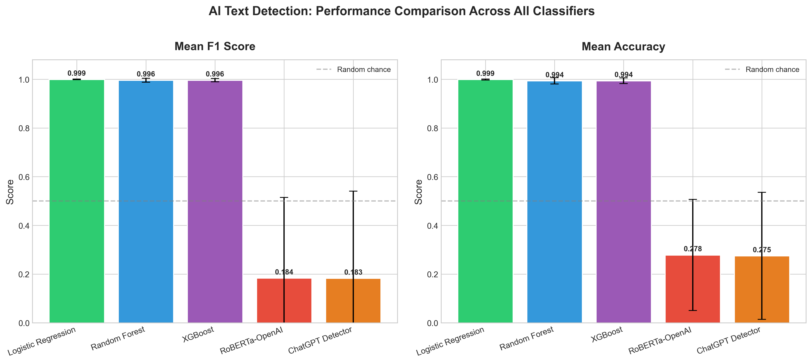
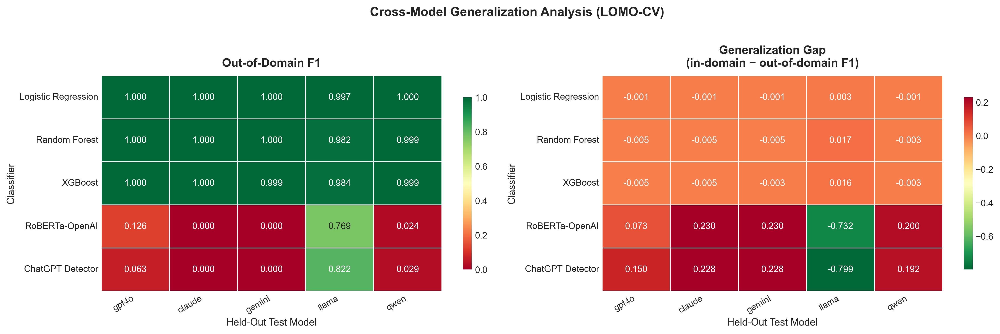
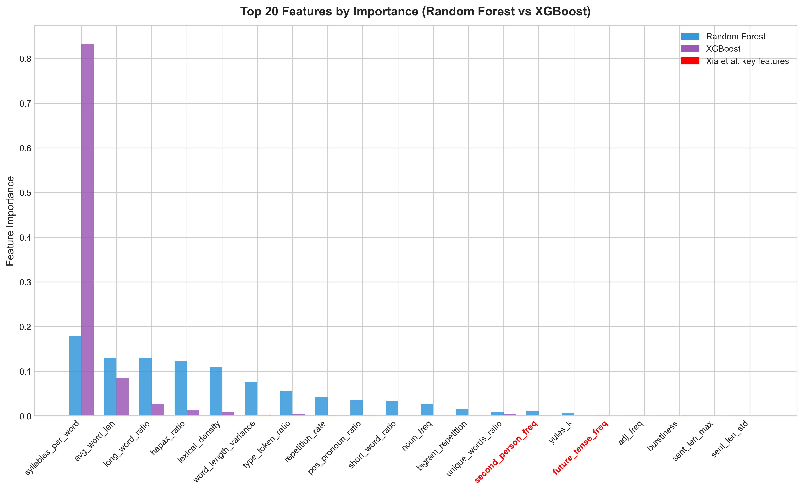
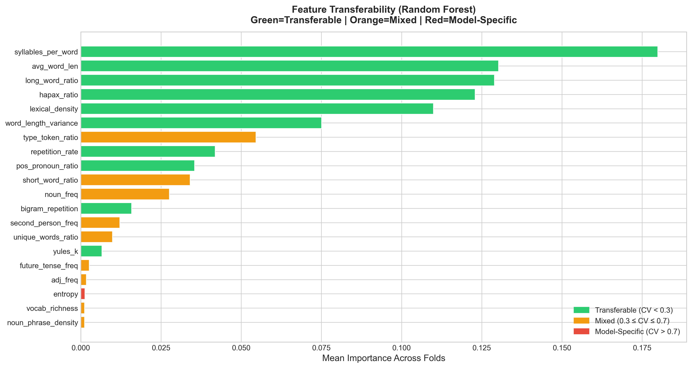

# Cross-Model Generalization in AI Text Detection: Comparing Feature-Based and Neural Approaches

## 👤 Team Member
**Melissa Amenuveve**
Florida State University — CAP5638 Pattern Recognition, Spring 2026
GitHub: [@Mamenuveve2201](https://github.com/Mamenuveve2201)
Hugging Face: [@amenuvevemelissa](https://huggingface.co/amenuvevemelissa)
Email:ma25ce@fsu.edu

---

## 🔍 Project Overview
Can a detector trained on GPT-4o catch text from a model it has never seen? This project investigates cross-model generalization in AI text detection by comparing classical ML classifiers against pre-trained neural detectors under a leave-one-model-out (LOMO) cross-validation protocol.

We built a 5,981-sample dataset across 5 LLMs and real student essays, extracted 41 stylometric features, and found that Logistic Regression achieves 99.94% F1 on unseen models while neural detectors average 18% F1.

🌐 **Live Web App:** [huggingface.co/spaces/amenuvevemelissa/ai-detector](https://huggingface.co/spaces/amenuvevemelissa/ai-detector)

---

## 📊 Results






---

## 📁 Repository Structure

```
├── 02_Data_Generation/       # Scripts to generate AI essays from 5 LLMs
├── 03_Feature_Extraction/    # 41-feature stylometric extractor
├── 04_Model_Training/        # Classical ML and neural baseline training
├── 05_Analysis_and_Results/  # Metrics, visualizations, error analysis
├── results/                  # Output CSVs and visualization images
├── app.py                    # Streamlit web application
├── 00_download_data.py       # Quick data download from Hugging Face
├── requirements.txt          # Python dependencies
└── README.md
```

---

## ⚙️ Setup

### Prerequisites
- Python 3.8+
- pip

### Install dependencies
```bash
pip install -r requirements.txt
```

---

## 📦 Data

You have two options to get the data:

### Option 1 — Quick Download (Recommended)
Download the preprocessed datasets directly from Hugging Face. No API keys needed.

```bash
python 00_download_data.py
```

Dataset hosted at: [huggingface.co/datasets/amenuvevemelissa/ai-text-detection-dataset](https://huggingface.co/datasets/amenuvevemelissa/ai-text-detection-dataset)

### Option 2 — Full Reproduction from Scratch
If you want to reproduce the dataset generation from scratch:

1. Download the PERSUADE 2.0 corpus from Kaggle: [kaggle.com/datasets/nbroad/persaude-corpus-2](https://www.kaggle.com/datasets/nbroad/persaude-corpus-2)
2. Place it in `data/raw/`
3. Get API keys for OpenAI, Anthropic, Google, and Groq
4. Add them to a `.env` file in the root:
```
OPENAI_API_KEY=your_key
ANTHROPIC_API_KEY=your_key
GOOGLE_API_KEY=your_key
GROQ_API_KEY=your_key
```
5. Run the scripts in order starting from `02_Data_Generation`

---

## 🚀 How to Run

Once you have the data, run the scripts in this order:

```bash
# Step 1 — Feature Extraction
python 03_Feature_Extraction/07_extract_basic_features.py
python 03_Feature_Extraction/08_extract_all_basic_features.py
python 03_Feature_Extraction/09_extract_stylometric_features.py
python 03_Feature_Extraction/10_add_features.py
python 03_Feature_Extraction/11_normalize.py
python 03_Feature_Extraction/12_create_folds.py

# Step 2 — Model Training
python 04_Model_Training/13_train_logistic.py
python 04_Model_Training/14_train_random_forest.py
python 04_Model_Training/15_train_xgboost.py
python 04_Model_Training/16_train_roberta.py
python 04_Model_Training/17_train_chatgpt_detector.py

# Step 3 — Analysis
python 05_Analysis_and_Results/18_metrics_analysis.py
python 05_Analysis_and_Results/19_generalization_gap.py
python 05_Analysis_and_Results/20_feature_importance_analysis.py
python 05_Analysis_and_Results/21_error_analysis.py
python 05_Analysis_and_Results/22_visualizations.py
```

---

## 🌐 Run the Web App Locally

```bash
streamlit run app.py
```

---

## 📋 Models Used

| Source | Model | API |
|--------|-------|-----|
| Human | PERSUADE 2.0 Corpus | — |
| AI | GPT-4o | OpenAI |
| AI | Claude Sonnet 4 | Anthropic |
| AI | Gemini 2.5 Flash | Google |
| AI | LLaMA 3.3 70B Versatile | Groq |
| AI | Qwen3 32B | Groq |

---

## 📈 Key Findings

- Logistic Regression: **99.94% mean F1** across unseen models
- Neural detectors (RoBERTa, ChatGPT Detector): **~18% mean F1**
- **syllables_per_word** is the single most important feature at 50.6% importance
- Xia et al. features (voice, tense, pronouns) rank #14–#40 — explanatory but not predictive
- Live app scored Mistral 7B text (never seen in training) at **98.7% AI confidence**

---

## 📄 References
See the final report for full references.

---

*CAP5638 Pattern Recognition — Florida State University — Spring 2026*
